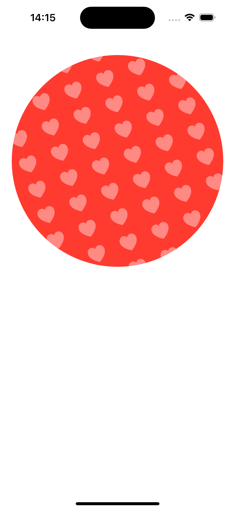
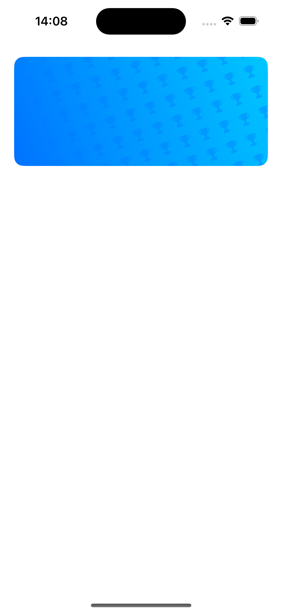

# SymbolOverlayKit

&nbsp;&nbsp;&nbsp;&nbsp;&nbsp;&nbsp;

### Customisable Symbol Shape Overlays in native SwiftUI

<p align="left">
  
  
  
  
</p>

## 🔍 Overview

This is an open-source library to use with SwiftUI. It allows you to create and customize symbol overlays for the native built-in SwiftUI shapes.

- Built with pure SwiftUI.
- Full customisation of colors, angles, overlay spacing, symbol size.
- Support for all out-of-the-box SF Symbols.

---

## 💻 Installation

### Swift Package Manager

The [Swift Package Manager](https://swift.org/package-manager/) is a tool for managing the distribution of Swift code. It’s integrated with the Swift build system to automate the process of downloading, compiling, and linking dependencies.

To integrate `SymbolOverlayKit` into your Xcode project using Xcode 12, specify it in `File > Swift Packages > Add Package Dependency...`:

```ogdl
https://github.com/chriswakefield87/SymbolOverlayKit.git, :branch="main"
```

---

## 🧳 Requirements

- iOS 14.0+ | macOS 11+
- Swift 5+

---

## 🛠 Usage

First, add `import SymbolOverlayKit` on every `swift` file you would like to use `SymbolOverlayKit`. Then, you can add the overlay modifer to a shape as follows:

```swift
import SymbolOverlayKit
import SwiftUI
```
The modifers are as follows (showing all parameters including optionals, see below table for parameter requirements).

**Note**: There is a modifier for each individual shape. The reason for this is to get the overlay clipping correct for each shape.

```swift

RoundedRectangle(cornerRadius: 15)
    .symbolOverlayRoundedRectangle(symbol: "crown.fill", size: 25, color: .blue, opacity: 0.2, rectangleCornerRadius: 15, rotation: -10, vspacing: 20, hspacing: 15)

Rectangle()
    .symbolOverlayRectangle(symbol: "crown.fill", size: 25, color: .blue, opacity: 0.2, rotation: -10, vspacing: 20, hspacing: 15)

Circle()
    .symbolOverlayCircle(symbol: "crown.fill", size: 25, color: .blue, opacity: 0.2, rotation: -10, vspacing: 20, hspacing: 15)

Capsule()
    .symbolOverlayCapsule(symbol: "crown.fill", size: 25, color: .blue, opacity: 0.2, rotation: -10, vspacing: 20, hspacing: 15)

Ellipse()
    .symbolOverlayEllipse(symbol: "crown.fill", size: 25, color: .blue, opacity: 0.2, rotation: -10, vspacing: 20, hspacing: 15)
```

### Parameters

| parameter          | type           | description                                              | required                       | default                                                                 
| ------------------ | -------------- | -------------------------------------------------------- | ------------------------------ | --------------
| symbol             | String         | the string name of the SF symbol to use in the overlay   | Y                              | NA
| size               | CGFloat        | font size of the symbol                                  | Y                              | NA                                                              
| color              | Color          | color of the symbol                                      | Y                              | NA
| opacity            | Double         | opacity of the symbol color                              | Y                              | NA
| rectangleCornerRadius            | Double         | should be the same as the cornerRadius for the RoundedRectangle shape                              | Y (Only for the symbolOverlayRoundedRectangle modifier)                              | NA
| rotation           | Double         | rotation amount of the overlay                           | N                              | -20
| vspacing           | CGFloat        | vertical spacing between symbol rows                     | N                              | 20                                                           
| hspacing           | CGFloat        | horizontal spacing between symbol columns                | N                              | 10                                                               

---

## 📱 Examples

#### Circle (With optional spacing parameters)

<p align="center">
  
</p>

```swift
var body: some View {
        GeometryReader { geo in
            VStack() {
                Circle()
                    .fill(.red)
                    .frame(width: geo.size.width * 0.9, height: geo.size.height * 0.5)
                    .symbolOverlayCircle(symbol: "heart.fill", size: 30, color: .white, opacity: 0.4, vspacing: 35, hspacing: 20)
                
                Spacer()
                
            }.frame(maxWidth: .infinity, maxHeight: .infinity)
                .padding(.top, 20)
        }
}
```

#### RoundedRectangle

<p align="center">
  
</p>

```swift
var body: some View {
        GeometryReader { geo in
            let gradientColor1 = Color(red: 0, green: 0.776, blue: 1)
            let gradientColor2 = Color(red: 0, green: 0.447, blue: 1)
            
            VStack() {
                RoundedRectangle(cornerRadius: 13)
                    .fill(
                        LinearGradient(
                            gradient: Gradient(colors: [gradientColor1, gradientColor2]),
                            startPoint: .topTrailing,
                            endPoint: .bottomLeading)
                    )
                    .frame(width: geo.size.width * 0.9, height: geo.size.height * 0.2)
                    .symbolOverlayRoundedRectangle(symbol: "trophy.fill", size: 16, color: .blue, opacity: 0.4, rectangleCornerRadius: 13)
                
                Spacer()
                
            }.frame(maxWidth: .infinity, maxHeight: .infinity)
                .padding(.top, 20)   
        }
}
```

---

## 👨‍💻 Contributors

All issue reports, feature requests, pull requests and GitHub stars are welcomed and much appreciated.

## ✍️ Author

Chris Wakefield

## 📃 License

`SymbolOverlayKit` is available under the MIT license.

## 📦 Projects

The following projects have integrated SymbolOverlayKit in their App.

- Laws of Power available on the [AppStore](https://apps.apple.com/us/app/laws-of-power-48-life-quotes/id6478054089)

---
