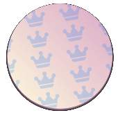
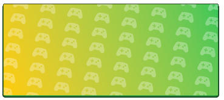
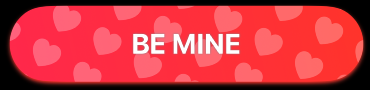

# SymbolOverlayKit

&nbsp;&nbsp;&nbsp;&nbsp;&nbsp;&nbsp;

### Customisable Symbol Shape Overlays in native SwiftUI

<p align="left">
  
  
  
  
</p>

## 🔍 Overview

This is an open-source library to use with SwiftUI. It allows you to create and customize symbol overlays for the native built-in SwiftUI shapes.

- Built with pure SwiftUI.
- Full customisation of colors, angles, overlay spacing, symbol size.
- Support for all out-of-the-box SF Symbols.

## 💻 Installation

### Swift Package Manager

The [Swift Package Manager](https://swift.org/package-manager/) is a tool for managing the distribution of Swift code. It’s integrated with the Swift build system to automate the process of downloading, compiling, and linking dependencies.

To integrate `SymbolOverlayKit` into your Xcode project using Xcode 12, specify it in `File > Swift Packages > Add Package Dependency...`:

```ogdl
https://github.com/chriswakefield87/SymbolOverlayKit.git, :branch="main"
```

---

## 🧳 Requirements

- iOS 14.0+ | macOS 11+
- Swift 5+

## 🛠 Usage

First, add `import SymbolOverlayKit` on every `swift` file you would like to use `SymbolOverlayKit`. Then, you can add the overlay modifer to a shape as follows:

```swift
import SymbolOverlayKit
import SwiftUI
```
The modifers are as follows (showing all parameters including optionals, see below table for parameter requirements).

**Note**: There is a modifier for each individual shape. The reason for this is to get the overlay clipping correct for each shape.

```swift

RoundedRectangle(cornerRadius: 15)
    .symbolOverlayRoundedRectangle(symbol: "crown.fill", size: 25, color: .blue, opacity: 0.2, rectangleCornerRadius: 15, rotation: -10, vspacing: 20, hspacing: 15)

Rectangle()
    .symbolOverlayRectangle(symbol: "crown.fill", size: 25, color: .blue, opacity: 0.2, rotation: -10, vspacing: 20, hspacing: 15)

Circle()
    .symbolOverlayCircle(symbol: "crown.fill", size: 25, color: .blue, opacity: 0.2, rotation: -10, vspacing: 20, hspacing: 15)

Capsule()
    .symbolOverlayCapsule(symbol: "crown.fill", size: 25, color: .blue, opacity: 0.2, rotation: -10, vspacing: 20, hspacing: 15)

Ellipse()
    .symbolOverlayEllipse(symbol: "crown.fill", size: 25, color: .blue, opacity: 0.2, rotation: -10, vspacing: 20, hspacing: 15)
```
